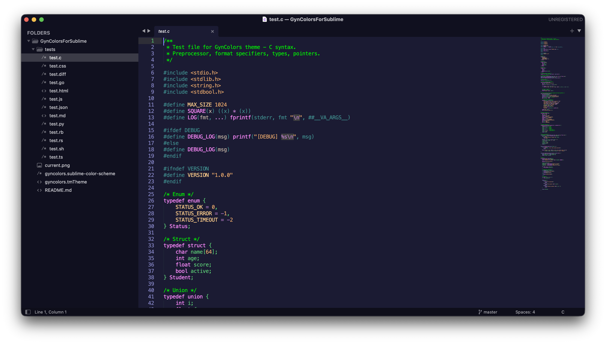

# GynColorsForSublime

Color scheme for Sublime Text matching [Gynvael Coldwind's vim colors](https://github.com/gynvael/stream/blob/master/inne/inkpot_gc.vim) (inkpot_gc).

Based on [pawlos/GynColorsForSublime](https://github.com/pawlos/GynColorsForSublime).



## Installation

Copy both theme files to your Sublime Text `Packages/User` directory:

| OS | Path |
|---|---|
| macOS | `~/Library/Application Support/Sublime Text/Packages/User/` |
| Linux | `~/.config/sublime-text/Packages/User/` |
| Windows | `%APPDATA%\Sublime Text\Packages\User\` |

```sh
# macOS example
cp gyncolors.sublime-color-scheme gyncolors.tmTheme \
  ~/Library/Application\ Support/Sublime\ Text/Packages/User/
```

For development, symlink instead of copying so edits are picked up immediately:

```sh
ln -s "$(pwd)/gyncolors.sublime-color-scheme" \
  ~/Library/Application\ Support/Sublime\ Text/Packages/User/
ln -s "$(pwd)/gyncolors.tmTheme" \
  ~/Library/Application\ Support/Sublime\ Text/Packages/User/
```

## Setup

### 1. Select the color scheme

`Cmd+Shift+P` (macOS) or `Ctrl+Shift+P` (Linux/Windows) → **UI: Select Color Scheme** → **GynColors**

### 2. Set the Adaptive theme

The color scheme controls syntax highlighting in the editor area. To make the sidebar, tabs, and status bar match the dark blue background, switch the UI theme to **Adaptive**:

`Cmd+Shift+P` / `Ctrl+Shift+P` → **UI: Select Theme** → **Adaptive**

Or add both settings to your preferences (`Cmd+,` / `Ctrl+,`):

```json
{
    "color_scheme": "gyncolors.sublime-color-scheme",
    "theme": "Adaptive.sublime-theme"
}
```

## Color palette

All colors come from the original [inkpot_gc.vim](https://github.com/gynvael/stream/blob/master/inne/inkpot_gc.vim):

| Color | Hex | Vim group | Usage |
|---|---|---|---|
| Bright green | `#00ff00` | Comment | Comments |
| Green | `#5ed378` | Normal | Default text |
| Lavender | `#B7B7F7` | Statement | Keywords, storage modifiers, HTML tags |
| Purple | `#c080d0` | Special | Operators, escape sequences, regex, pseudo-classes |
| Magenta | `#ff8bff` | Identifier/Type | Functions, classes, types |
| Orange | `#f0ad6d` | String/Number | Strings, numbers |
| Light orange | `#ffcd8b` | Constant | Constants, attributes, mapping keys |
| Teal | `#409090` | PreProc | Imports, preprocessor, decorators |
| Dark red | `#af4f4b` | Title | Headings, section names |
| Golden | `#df9f2d` | Underlined | Links |
| Beige | `#cfbfad` | MatchParen | Parameters, bracket matching |
| Muted blue | `#8b8bcd` | LineNr | Gutter, blockquotes |
